# Diagram Library

## Purpose

This document is a reusable diagram pack for the **Agentic SDLC Platform**.

It is designed so the same core system can be explained in different contexts:

- thesis and academic writing
- research papers
- architecture and technical documentation
- investor and business presentations
- sales and design-partner conversations
- product demos

All diagrams are written in **Mermaid** so they can be:

- rendered directly in GitHub-compatible markdown
- copied into Mermaid Live
- redrawn in draw.io, Figma, Lucidchart, or PowerPoint
- adapted for papers and slides

## Recommended Usage by Audience

### Business and investor material

Use these first:

- Diagram 1: System Context
- Diagram 2: Trust Loop and Product Wedge
- Diagram 3: Governed SDLC Flow
- Diagram 9: Mission Control Surface Model
- Diagram 13: Business Value Chain

### Academic thesis or research paper

Use these first:

- Diagram 1: System Context
- Diagram 4: Runtime Component Architecture
- Diagram 5: Execution Graph and Stage Lanes
- Diagram 6: Run Execution Sequence
- Diagram 7: Execution Contract Assembly
- Diagram 10: Failure and Recovery State Model
- Diagram 11: Conceptual Data Model
- Diagram 12: Research Evaluation Framework

### Technical architecture docs

Use these first:

- Diagram 4: Runtime Component Architecture
- Diagram 5: Execution Graph and Stage Lanes
- Diagram 6: Run Execution Sequence
- Diagram 7: Execution Contract Assembly
- Diagram 8: Architecture Profile and Knowledge Loop
- Diagram 10: Failure and Recovery State Model
- Diagram 11: Conceptual Data Model

## Diagram 1: System Context

Best for:

- thesis introduction
- product overview
- architecture summary
- investor deck

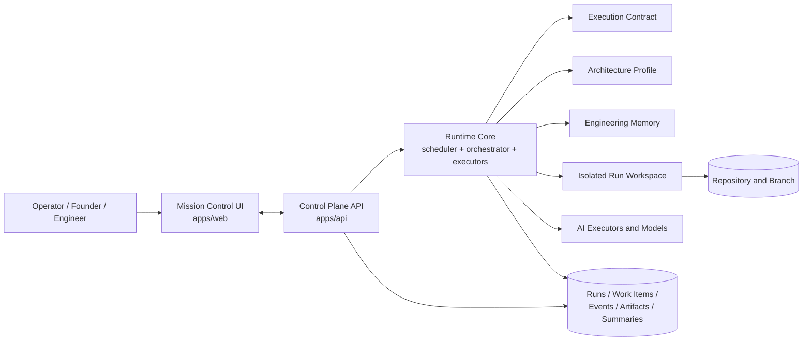

## Diagram 2: Trust Loop and Product Wedge

Best for:

- startup pitch
- website
- customer conversation
- problem framing

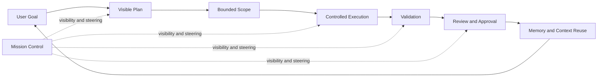

## Diagram 3: Governed SDLC Flow

Best for:

- academic explanation
- product deck
- workflow overview

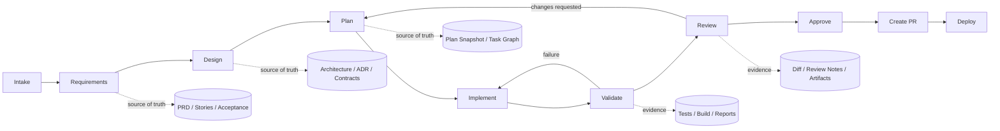

## Diagram 4: Runtime Component Architecture

Best for:

- thesis chapter
- architecture doc
- technical appendix

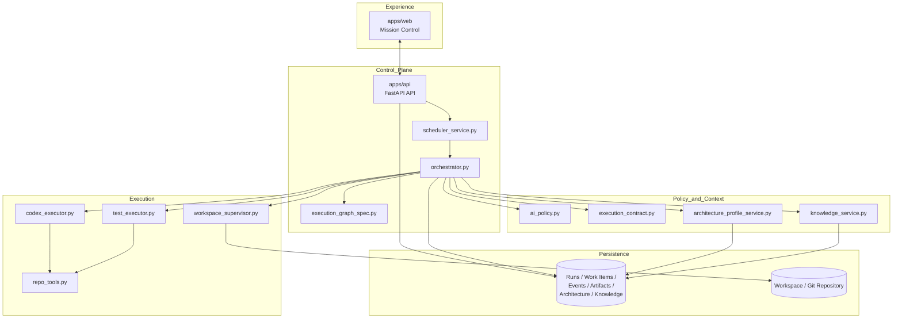

## Diagram 5: Execution Graph and Stage Lanes

Best for:

- runtime explanation
- paper figure
- operator training

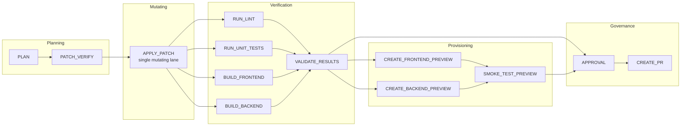

## Diagram 6: Run Execution Sequence

Best for:

- thesis methodology
- runtime walkthrough
- live demo narration

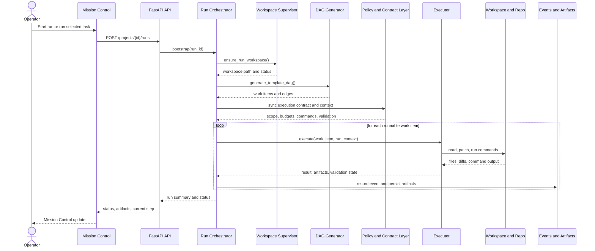

## Diagram 7: Execution Contract Assembly

Best for:

- core research figure
- thesis contribution chapter
- technical design review

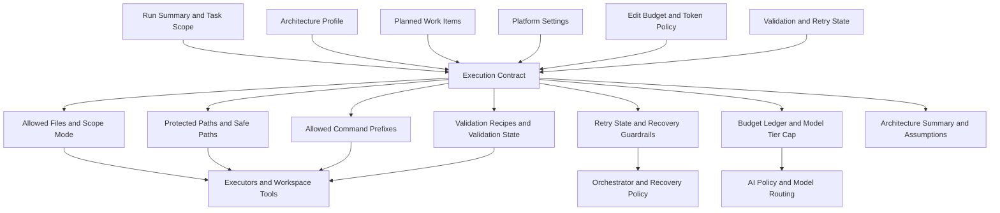

## Diagram 8: Architecture Profile and Knowledge Loop

Best for:

- research narrative
- technical docs
- future-work explanation

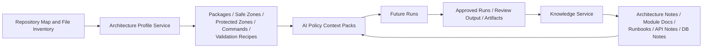

## Diagram 9: Mission Control Surface Model

Best for:

- product documentation
- UI explanation
- operator demo

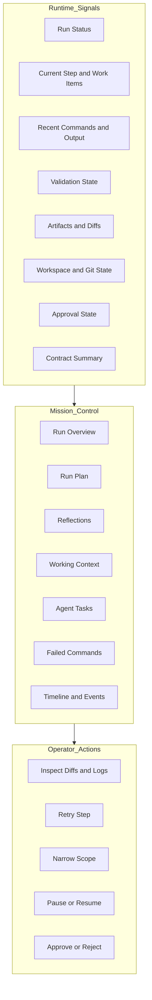

## Diagram 10: Failure and Recovery State Model

Best for:

- research paper
- runtime appendix
- recovery and reliability section

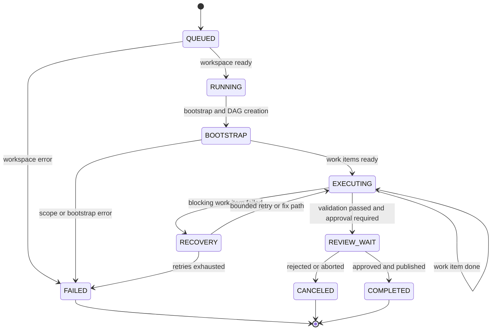

## Diagram 11: Conceptual Data Model

Best for:

- thesis chapter
- system design appendix
- architecture documentation

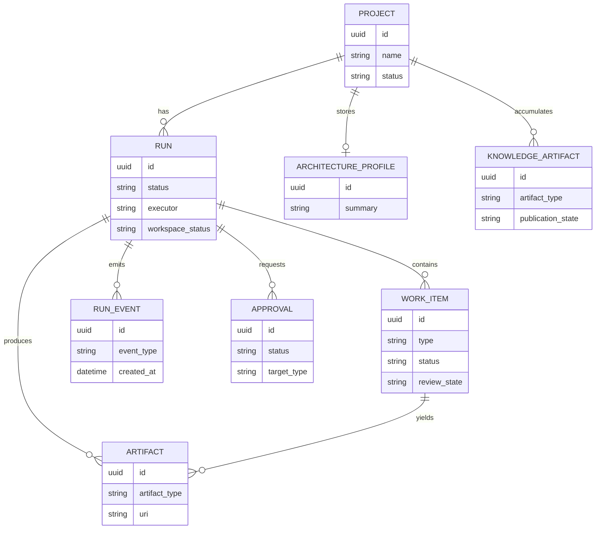

## Diagram 12: Research Evaluation Framework

Best for:

- thesis proposal
- paper methodology section
- experiment design

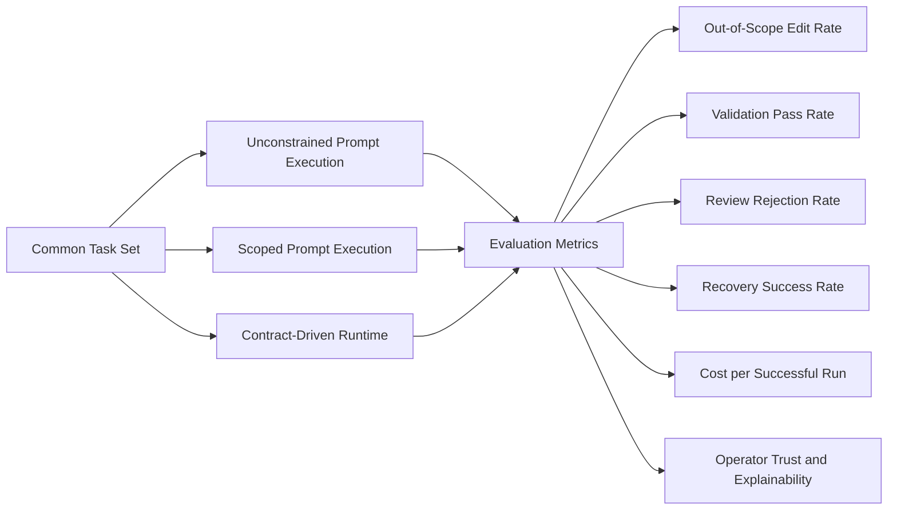

## Diagram 13: Business Value Chain

Best for:

- investor deck
- website
- sales deck
- accelerator application

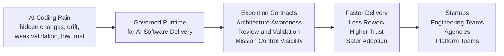

## Suggested Reuse Patterns

### Minimal startup pitch set

Use:

- Diagram 1
- Diagram 2
- Diagram 13

### Product demo set

Use:

- Diagram 3
- Diagram 6
- Diagram 9

### Thesis proposal set

Use:

- Diagram 1
- Diagram 4
- Diagram 7
- Diagram 12

### Full technical appendix set

Use:

- Diagram 4
- Diagram 5
- Diagram 6
- Diagram 7
- Diagram 8
- Diagram 10
- Diagram 11

## Final Note

These diagrams are intentionally written at multiple abstraction levels:

- product level
- workflow level
- runtime level
- data level
- research level
- business level

That is the right approach for this project because the platform needs to be explainable both as:

- a software engineering system
- a research contribution
- a commercial product
